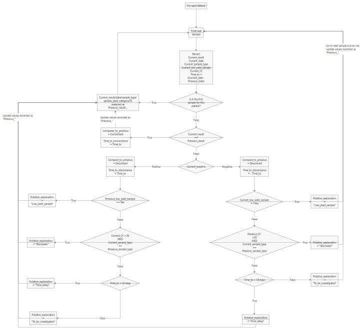

# SARS-CoV-2 discrepant screen 
A  R script to support quality monitoring of the flow of SARS-CoV-2 RT-PCR results based on the opportunity provided by repeated testing on patients. See our [preprint](https://doi.org/10.1101/2020.07.27.20162123) for more on the motivations to develop this script and the results of its application on the four first months of the epidemic in our clinical laboratory. 

Code is available without warranty (see license).

## Overall description
  The provided R code was used to screen for discrepancies among patients with repeated testing. This code was originally designed during the COVID-19 epidemic to cope with the great flow of SARS-CoV-2 RT-PCR. However, this approach could be of interest for longitudinal surveillance of other molecular assays. 

  This R script can be applied on a regular basis (e.g. daily) for continuous surveillance of results and early detection of cases potentially requiring biomedical expertise or further investigations.  

## Inputs/output structure and functions of the script
##### Inputs:
 - **New results table** (*file name set in parameters by user*):
 A table of results to be validated. In our case, this table was extracted on a regular basis from MOLIS (CGM), our Laboratory Information Information System (LIS).
 This table must be a ".xlsx" spreadsheet with one line per result and sufficient columns to describe all needed parameters.

  - **Table of all previous results** (*0_previous_results_database.xlsx*):
  A table with all results up to now. Practically, this table is completed with the content of the *New results table* at each execution of the script. Thus, the *New results table* provided to the script on its first execution should contain all available results. On this first execution, this table will be created based on the content of *New results table*. Then, on subsequent execution of the script, new results provided in the *New results table* will be added to this table to have a complete, up-to-date, database for results comparison. Since this table is automatically created by the script if missing, no intervention are needed. 

  - **Sample types dictionary** (*file name set in parameters by user*) 
  This ".xlsx" file must contain two sheets, both with two columns. 
  On the first sheet, the 1st column must contain an exhaustive non-redundant list of all the exact values possibly taken to describe "sample type" (or specimen nature, e.g. "Nasopharyingeal swab"). The 2nd columns is used to regroups similar samples types in broader categories (e.g. upper respiratory tract samples).

    *Example for sheet 1 of sample types dictionary table*
    | Sample type  |  Category |
    |---|---|---|---|---|
    | Nasopharyingeal swab  | URT|
    | nasopharyingeal swab  | URT|
    |  Oropharyingeal swab |  URT | 
    |  Feces  | Rectal/feces  |  
    |  Rectal swab  | Rectal/feces  |  
    |  Blood  | Blood  |  
    
    On the second sheet, the 1st column should be a complete, non-redundant, list of the categories as defined in the 2nd columns of the 1st sheet. The second column should code with Y (Yes) or N (No) if the sample categories is a "low yield sample" type. In our case, we had defined as "low yield samples" categories of specimen positive in less than 5% of cases. (Please note that this value has to be adapted to the prevalence of the disease. This value was defined in the initial phase of the epidemic when over 10% of nasopharyngeal swabs were positive). 

    *Example for sheet 2 of sample types dictionary table*
    | Category type  | Low Yield  |
    |---|---|---|---|---|
    | URT  | N |
    |  Rectal/feces  | N  |  
    |  Blood  | Y  | 
    Of note, to work, the script requires that values of the column defined in parameters as "sample type" to be found in the dictionary. If one is missing, the script will stop and generate a ".xlsx" table named "3_sample_source_dictionary_missing.xlsx". If this table is generated, then its content should be copy-pasted into the first column of the dictionary table and categorized adequately by filling the second column and the second sheet.

  - **Already reviewed cases** (*2_solved_cases_updated.xlsx*):
    The script will, on each execution, identified patients with discrepancies that cannot be explained by on rules encoded in the script (see below). These should be reviewed manually and adequately investigated. Once investigated, those cases (i.e. their corresponding rows) should be copy-pasted into this *already validated table* so that they do not appear again on the next execution of the script. 

##### Outputs:
  - **Discrepant cases to be reviewed** (*3_to_be_validated_.xlsx*):
    This file will be completed by each successful execution of the script with all results involved in a discrepant pairwise comparison. Those cases should be reviewed. Then, the full row should be cut-pasted into the *2_solved_cases_updated.xlsx* table so that they do not appear on next execution of the script.  

  - **Sample types missing from dictionary**   (*3_sample_source_dictionary_missing.xlsx*):
   This table will list values found in the sample type column that are not in the sample dictionary. This file in created only if some value are missing and is otherwise erased.   

  - **Table of all previous results** (*0_previous_results_database.xlsx*):
    See *Table of all previous results* in *Inputs*

  - **Traceability and figures folder** (*{date}_{hour}_{userID}*):
    A folder with a copy of all input and output files is created on each execution of the script for traceability.
    
##### Embedded discrepancies classification algorithm:
   The script was designed to limit the number of "false positive", i.e. the number of discrepancies to be reviewed manually. The script goes through the results of each patient with more than one result. It reviews results in the chronological order and compare them in a pairwise fashion. In case of discrepant results for the two samples taken in the pairwise comparison, (negative versus positive or the reverse), it then tries to apply three rules which could easily explain the observed difference. Then, if no rule applies, it will record the incriminated results into the table of *Discrepant cases to be reviewed*. 
   
   Adapted from our [preprint](https://doi.org/10.1101/2020.07.27.20162123), the 3 rules that could explain and classify the discrepancies are:

 1) *Stochasticity* 
    This classification is retained by the algorithm when the positives sample of the discrepant pair present a Ct values over a user-defined value (35 in our case). 
 2) *Low yield* 
    This classification is retained in cases where the negative sample of the pair of discrepant results belonged to a sample type category classified as low yield in the input *Sample types dictionary*. In other words, the discrepancy could be explained by the fact that the sample that yields a negative result was anyway rarely or never positive (e.g. blood).
3) *Time delay*
    This explanation is retained by the algorithm when the time interval between the two compared samples is over 10 days. Indeed, in this case, the discrepancy could be explained by the evolution of the disease (new infection or disease resolution).

Finally, results incriminated in none of these explanation are classified as *To be investigated* and recorded in the *Discrepant cases to be reviewed* table.

Please note that, as descriped in our [preprint](https://doi.org/10.1101/2020.07.27.20162123) 
*"...the script was designed to compare each sample only to the last relevant result. For instance, a positive nasopharyngeal swab followed by a negative PCR in blood, and then later by another positive nasopharyngeal swab, will lead to only one discrepancy: the negative blood classified as a “Low yield”. The second nasopharyngeal swab wilbe classified as concordant with the previous nasopharyngeal swab. Of note, two nasopharyngeal samples taken more than 10 days apart once negative and once positive with a Ct > 35, would be classified as “Stochastic” and not as “Time delay”. Indeed, discrepancies were classified according to the first matching criteria in the following order: “Low yield”, “Stochastic”, “Time delay" and “To be investigated”, as detailed in the graphical scheme of the decisional algorithm (below). Furthermore, a result from a patient with 3 samples or more can be involved both in a concordant and a discrepant pairwise comparisons. Indeed, the second of his analyses could be in agreement with the first of his results but discrepant with the third. "*

*Discrepancies classification algorithm :*

## Manual

##### Requirements: 
  - R: *tested with v. 3.6*
  - Installed packages: *readxl, tidyr, dplyr, writexl, ggplot2, scales, furniture, htmlTable, colorspace, forcats, rtf, data.table, rlang*
  - A spreadsheet software capable of modifying ".xlsx" files
  - A ".xlsx" file with RT-PCR results: *each result must be a row and there should have sufficient columns to describe all parameters (see below)*. 

##### First execution:
 1. Extract from your LIS in a ".xlsx" spreadsheet all results to screen for discrepancies. 
 2. Complete in the R script the parameters in the "PARAMS" chunk of code as follows. See in code for explanations on how to complete these parameters.
 3. Run all the code.
 4. If the "3_missing_IPP.xlsx" table is created, you have samples without value in the *patient_ID* column. Please observe.
 5. The "3_sample_source_dictionary_missing.xlsx" is created and the code raises an error ("Unkown sample types. Those were written in "3_sample_source_dictionary_missing.xlsx". These should be added to "sample_source_dictionary.xlsx" and the script re-run"). As indicated, complete the *Sample types dictionary*. 
 6. Re-run the code. It should now work.
 7. The outputs (see *Outputs* section) are generated.
 8. Review *Discrepant cases to be reviewed* table.
 9. Cut and paste rows of reviewed cases into the *Already reviewed cases* table ("2_solved_cases_updated.xlsx").
 10. Browse figures and tables in the created folder. They can help you get interesting information on your flow of results.  

##### Next executions:
1. The extracted table of results can now only contain new results. However, if results are already in the*Table of all previous results*, only new results of results that have change will be added to the database.
2. You  need to update the name of the input table of in the parameter chunk of code to fit the filename of your newly extracted table.
3. Run the code. 
4. In case new sample type identifier appeared in results, you may need to update the sample dictionary as in the first execution of the code.  
